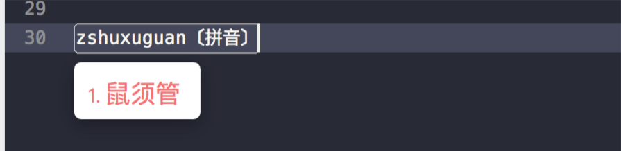
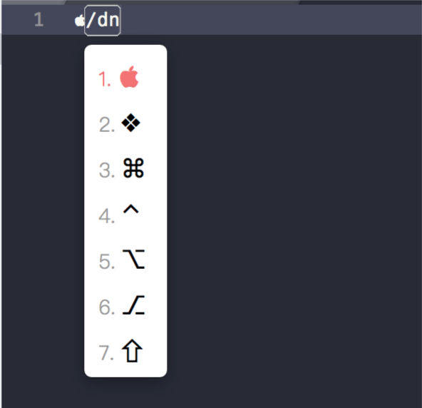

# rime-wubi

鼠须管的wubi86相关配置

### default.custom.yaml

默认的切换与一些应用的设置冲突，故改之。

### wubi86.custom.yaml

五笔输入自定义的一些设置。如：

自定义输出符号

使用 `wubi86.extended` 五笔字典。见 `wubi86.extended.dict.yaml`

### squirrel.custom.yaml

自定义主题样式，设置在某些 App 中打开默认使用英文。

### 基本使用

`z` 键 临时切换成拼音。

`/` 匹配符号，详见 symbols.yaml 文件。

